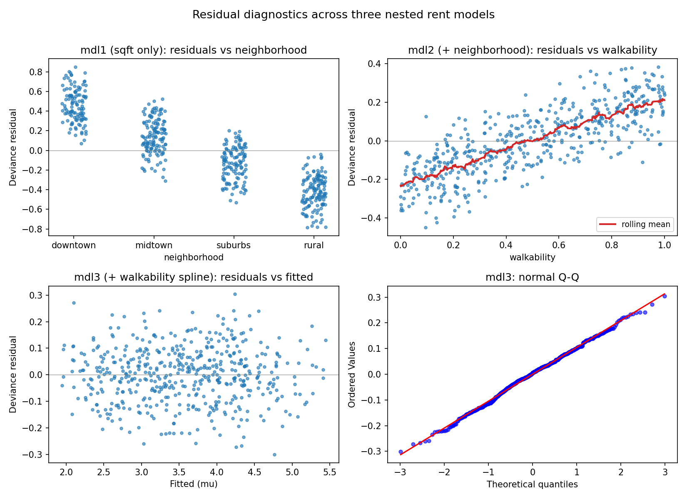

Evaluating Model Fit
====================

A converged fit is not the same as a good fit. ADMM will happily return
coefficients for a model whose family is wrong, whose link is
mis-specified, or that is missing a feature with substantial predictive
signal. This guide covers the two questions that come after
:meth:`~gamdist.GAM.fit` returns:

1. **Is this model adequate?** Does it describe the data, or does it
   leave systematic structure on the table?
2. **Among candidate models, which should we prefer?** When two fits
   both look reasonable, the right one is rarely the one with the
   smallest residual sum of squares.

The first question is answered by inspecting residuals; the second by
information criteria. We work through both on the apartment-rent
example from the :doc:`getting_started` guide.

Before reading this guide, run the data-generation block from that
guide to populate ``X`` and ``y``; everything below assumes those names
are in scope.

Information criteria
--------------------

:meth:`~gamdist.GAM.summary` reports six fit statistics:

- **Deviance** --- twice the gap in log-likelihood between the fitted
  model and a saturated model that interpolates the data. Smaller is
  better, but adding any feature reduces deviance, so deviance alone
  is not a model-selection tool.
- **R**\ :sup:`2` --- the deviance-based pseudo-:math:`R^2`,
  :math:`1 - D / D_0`, where :math:`D_0` is the deviance of the
  intercept-only model. Same caveat: monotone in feature count.
- **AIC** (:meth:`~gamdist.GAM.aic`) --- deviance plus :math:`2 p`,
  where :math:`p` is the effective parameter count. Penalizes
  complexity; lower is better; differences below 2 are usually
  not meaningful.
- **AICc** (:meth:`~gamdist.GAM.aicc`) --- AIC with the Hurvich-Tsai
  small-sample correction. Identical to AIC asymptotically; prefer it
  when :math:`n / p` is small (rule of thumb: :math:`n / p < 40`).
- **BIC** --- deviance plus :math:`p \log n`. Penalizes complexity more
  aggressively than AIC and is consistent for selecting the true model
  when one exists in the candidate set.
- **GCV** (:meth:`~gamdist.GAM.gcv`) / **UBRE**
  (:meth:`~gamdist.GAM.ubre`) --- generalized cross-validation and
  the unbiased risk estimator. Both approximate out-of-sample squared
  error without refitting. ``summary()`` prints UBRE when the
  family fixes the dispersion (Poisson, binomial) and GCV otherwise.

For routine model comparison, AIC (or AICc on small samples) is the
most useful single number. Use BIC when you specifically want a
parsimonious model and believe the true effect set is finite. Use GCV
to choose the smoothing of a single spline at fixed model structure.

A worked comparison
~~~~~~~~~~~~~~~~~~~

The :doc:`getting_started` guide fit three nested models on the rent
data. Their fit statistics:

.. list-table::
   :header-rows: 1
   :widths: 34 10 12 10 10 10

   * - Model
     - edof
     - Deviance
     - AIC
     - AICc
     - R\ :sup:`2`
   * - sqft only
     - 2
     - 67.1
     - 504
     - 504
     - 0.79
   * - + neighborhood
     - 5
     - 14.6
     - 507
     - 507
     - 0.95
   * - + walkability (spline)
     - 9
     - 5.4
     - 511
     - 511
     - 0.98

Two things are worth noting. First, AIC *increases* with each addition
even though deviance and :math:`R^2` improve. AIC penalizes a feature
by :math:`2 \hat\phi` per effective degree of freedom, and as
:math:`\hat\phi` shrinks --- which it does each time we explain more
variance --- the threshold a new feature must clear gets lower. The
absolute AIC is not directly interpretable; only differences between
models on the *same* data are. Second, the AIC differences here are
small (3, then 4), so on AIC alone the case for ``mdl3`` over
``mdl1`` is suggestive rather than decisive. Residual diagnostics
settle the question conclusively, as we will see below.

Residuals
---------

For a Gaussian model with identity link, residuals are simply
:math:`y - \hat{y}`. For other families, that definition is not
useful: a Bernoulli observation is 0 or 1, so :math:`y - \hat\mu` is
bounded in :math:`[-1, 1]` regardless of how badly :math:`\hat\mu` is
estimated. :meth:`~gamdist.GAM.residuals` therefore offers four
flavors, each useful in different contexts.

.. list-table::
   :header-rows: 1
   :widths: 16 30 54

   * - Kind
     - Definition
     - Use when
   * - ``response``
     - :math:`y - \hat\mu`
     - Gaussian / continuous outcome on the natural scale, or for
       quick sanity checks.
   * - ``pearson``
     - :math:`(y - \hat\mu) / \sqrt{\hat\phi \, V(\hat\mu)}`
     - You want a unit-variance residual whose sum of squares
       approximates a :math:`\chi^2`. Can be unstable when
       :math:`V(\hat\mu)` is near zero (e.g., Poisson with very small
       fitted means).
   * - ``deviance`` *(default)*
     - :math:`\operatorname{sign}(y - \hat\mu)\sqrt{d_i}` where
       :math:`d_i \ge 0` is the per-observation deviance.
     - General-purpose. Squaring and summing recovers the total
       deviance; usually better-behaved than Pearson on count and
       binary data.
   * - ``anscombe``
     - :math:`(A(y) - A(\hat\mu)) / \bigl(V(\hat\mu)^{1/6}
       \sqrt{\hat\phi}\bigr)` with :math:`A(t) = \int V(s)^{-1/3}
       \mathrm{d}s`
     - You need an approximately-standard-normal residual for QQ
       plotting on a small sample. Reduces to the Pearson residual
       under the Gaussian family.

Wood (2017, *Generalized Additive Models: An Introduction with R*,
§3.1.7) covers the same set with worked distributions; McCullagh and
Nelder (1989, *Generalized Linear Models*, §2.4.1) derives the
Anscombe transformation and tabulates it for each family.

The default kind is ``"deviance"``: it generalizes cleanly to all
supported families, is well-behaved on small fitted means, and its sum
of squares is interpretable as a model-fit statistic. Switch to
``"anscombe"`` when you specifically need a QQ plot to look standard
normal under correct specification.

Computing residuals directly is occasionally useful::

    residuals = mdl3.residuals()              # deviance residuals
    np.sum(residuals ** 2)                    # ~= mdl3.deviance()
    pearson = mdl3.residuals(kind="pearson")

But most of the time you want a plot.

Diagnostic plots
----------------

gamdist provides two residual-plotting helpers.
:meth:`~gamdist.GAM.plot_residuals` produces the canonical pair ---
residuals against fitted values, plus a normal QQ plot ---
side-by-side. :meth:`~gamdist.GAM.plot_residuals_vs_predictor` plots
residuals against an arbitrary predictor (numeric or categorical),
which is the right tool for diagnosing structure tied to a specific
covariate.

Residuals vs. fitted, and the QQ plot
~~~~~~~~~~~~~~~~~~~~~~~~~~~~~~~~~~~~~

.. code-block:: python

    fig = mdl3.plot_residuals()    # kind="deviance" by default

What you want to see:

- The left panel (residuals vs. :math:`\hat\mu`) is a featureless cloud
  centered on zero. No trend, no funnel.
- The right panel (QQ against the standard normal) is a straight line.
  Heavy tails curl up at the top right and down at the bottom left;
  light tails do the opposite.

What you do *not* want to see:

- A clear curve in the left panel --- the conditional mean is
  mis-specified somewhere (missing nonlinearity or wrong link).
- A funnel widening with :math:`\hat\mu` --- variance is mis-specified
  (consider a different family, or check whether the link is wrong).
- Pronounced QQ tails --- the family's tail is too thin or too thick;
  consider Huber loss for Gaussian-like data with outliers.

Residuals vs. a predictor
~~~~~~~~~~~~~~~~~~~~~~~~~

The fitted-value plot collapses every predictor onto :math:`\hat\mu`,
which obscures *which* predictor a residual pattern is attached to.
:meth:`~gamdist.GAM.plot_residuals_vs_predictor` puts a chosen
predictor on the x-axis instead.

For a predictor **in the model**, structure in the residuals indicates
the feature is in the model in the wrong form --- typically a linear
term that should be a spline.

For a predictor **not in the model**, structure indicates the
predictor carries signal the model is missing.

A diagnosis-and-fix cycle
-------------------------

To make this concrete, consider an analyst who fits the simplest
plausible model on the rent data and inspects it before reaching for
features:

.. code-block:: python

    mdl1 = GAM(family='normal')
    mdl1.add_feature('sqft', type='linear')
    mdl1.fit(X, y)
    mdl1.plot_residuals()

The QQ plot is roughly straight (the noise process is Gaussian by
construction), but the left panel shows a wide vertical spread at
every fitted value. The model's :math:`\hat\phi \approx 0.135` is more
than ten times the true noise variance of :math:`0.01`, and the
residuals reflect that. We have unmodelled signal somewhere; the
question is where.

.. code-block:: python

    mdl1.plot_residuals_vs_predictor(X['neighborhood'], name='neighborhood')

Now the structure is unmissable: the residual cloud sits noticeably
high for ``downtown``, low for ``rural``, with ``midtown`` and
``suburbs`` in between. That is the neighborhood offset showing
through the residuals because the model has no way to absorb it.
Adding ``neighborhood`` as a categorical feature is the obvious fix,
and produces ``mdl2`` from the getting-started guide.

After refitting, the same plot against ``walkability`` reveals the
remaining structure:

.. code-block:: python

    mdl2.plot_residuals_vs_predictor(X['walkability'], name='walkability')

The residuals trace out a concave-increasing arc --- exactly the
shape of the true :math:`0.5 \cdot w^{0.7}` effect that ``mdl2``
ignores. Adding ``walkability`` as a *spline* feature (a linear term
would not capture the curvature, and the residual plot would still
show structure) gives ``mdl3``. A final pass through
:meth:`~gamdist.GAM.plot_residuals` and
:meth:`~gamdist.GAM.plot_residuals_vs_predictor` for each predictor
shows featureless residual clouds on every axis and a straight QQ
plot. The model has captured the systematic structure.

         models. Top-left: residuals from mdl1 plotted against
         neighborhood, showing a clear offset pattern. Top-right:
         residuals from mdl2 plotted against walkability, showing
         a concave-increasing arc traced by a rolling-mean overlay.
         Bottom-left: residuals from mdl3 plotted against fitted
         values, showing a featureless cloud centered on zero.
         Bottom-right: a normal Q-Q plot of mdl3's residuals,
         falling on the reference line.
   :align: center

   Residual diagnostics across the three nested models. Each fix
   removes structure that was visible in the previous model's
   residuals: adding ``neighborhood`` flattens the categorical
   pattern (top-left), adding the walkability spline straightens the
   arc (top-right), and the final model leaves no structure on
   either the fitted axis (bottom-left) or the QQ plot
   (bottom-right).

Notice that residual diagnostics gave a much sharper verdict than the
information-criteria comparison did. The AIC differences between
``mdl1``, ``mdl2``, and ``mdl3`` were all in single digits --- on AIC
alone the case for the larger models is plausible but not crushing.
The residual plots leave no doubt: ``mdl1`` and ``mdl2`` have
unmodelled structure, ``mdl3`` does not. In practice, use both: AIC /
AICc to compare candidate models on a common footing, residual plots
to check whether any of them is actually adequate.

A few practical notes
---------------------

- **Convergence first.** A fit that did not converge will have
  meaningless residuals. Check that the primal / dual residual histories
  from :meth:`~gamdist.GAM.fit` are below their tolerances before
  running diagnostics.
- **Anscombe for QQ on small samples.** The deviance residual is
  approximately standard normal in the limit, but on small samples its
  tails can be slightly off. Anscombe residuals are tuned to be more
  nearly normal in finite samples; switch with ``kind="anscombe"`` if
  the QQ plot's tails look suspect.
- **Predictor not on file.** :meth:`plot_residuals_vs_predictor`
  accepts any 1-D array of length ``n_obs``, so you can plot residuals
  against a covariate that was never registered with
  :meth:`~gamdist.GAM.add_feature`. This is the standard way to decide
  whether to add a new predictor before fitting it.
- **Categorical x-axes work.** Pass an ``object``-dtype array (e.g.,
  a column of strings) and the helper switches to a categorical
  x-axis automatically.

