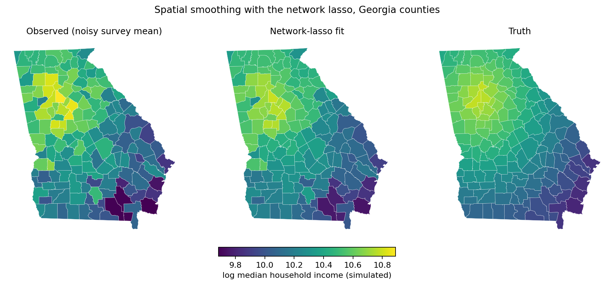

Spatial Smoothing with the Network Lasso
========================================

This guide walks through a small-area-estimation problem: we have noisy
per-county survey estimates of (log) median household income across the
state of Georgia and we want a smoothed map that borrows strength
between neighboring counties. The natural tool is gamdist's
:doc:`categorical feature <../api>` with **network lasso**
regularization on the county-adjacency graph, which adds an L1 penalty
to coefficient differences along graph edges and therefore *fuses*
neighbors to identical values rather than merely shrinking them toward
each other.

By the end you will have produced a three-panel choropleth contrasting
the raw observations, the network-lasso fit, and the (simulated) ground
truth, and you will have seen how to obtain real county geometries with
a couple of lines of :mod:`geopandas` --- no hand-curated SVG required.

Extra dependencies
------------------

The example uses two libraries that are *not* runtime dependencies of
gamdist itself:

- `geopandas <https://geopandas.org/>`_ for reading the county
  shapefile and rendering the choropleth.
- `libpysal <https://pysal.org/libpysal/>`_ for the bundled Georgia
  counties dataset and for building the Queen-contiguity adjacency
  graph.

Install them into your environment alongside gamdist:

.. code-block:: bash

    pip install geopandas libpysal

The same workflow generalizes to any other shapefile or GeoJSON of
geographic units --- US counties from the Census TIGER/Line files,
ZIP-code tabulation areas, school districts, electoral precincts, and
so on. We use Georgia's 159 counties because the geometries are
bundled with libpysal and the example runs in a few seconds.

Loading the geometry
--------------------

`libpysal.examples` ships a small library of spatial datasets that load
without an internet round-trip. The ``georgia`` example contains a
shapefile of Georgia's 159 counties together with 1990 socio-economic
attributes. We need only the geometries:

.. code-block:: python

    import geopandas as gpd
    from libpysal.examples import load_example

    ex = load_example('georgia')
    counties = gpd.read_file(ex.get_path('G_utm.shp'))
    counties['county_id'] = counties['AreaKey'].astype(str)

    print(counties.shape)         # (159, 18)
    print(sorted(counties.columns)[:6])
    # ['AREA', 'AreaKey', 'G_UTM_', 'G_UTM_ID', 'Latitude', 'Longitud']

A :class:`geopandas.GeoDataFrame` is a regular :class:`pandas.DataFrame`
with one extra column --- ``geometry`` --- holding a Shapely polygon
per row. ``AreaKey`` is the FIPS code; we promote it to a string so it
can serve as our categorical level.

Building the adjacency graph
----------------------------

Network lasso needs an *edge list*: a DataFrame with three columns
``node1``, ``node2``, and ``weight`` describing which categories should
be encouraged to share a coefficient. For spatial data the natural
choice is **Queen contiguity**: two polygons are neighbors if they
share any boundary point (vertex or edge). :mod:`libpysal.weights` has
this built in:

.. code-block:: python

    import pandas as pd
    from libpysal.weights import Queen

    w = Queen.from_dataframe(counties, use_index=False)

    pairs = []
    for i, neighbors in w.neighbors.items():
        for j in neighbors:
            if i < j:                       # each undirected edge once
                pairs.append((counties.iloc[i]['county_id'],
                              counties.iloc[j]['county_id']))
    edges = pd.DataFrame(pairs, columns=['node1', 'node2'])
    edges['weight'] = 1.0

    print(len(edges))    # 431

Each row of ``edges`` says "these two counties are neighbors and should
contribute a penalty term ``weight * |β_node1 - β_node2|`` to the
fit". A larger ``weight`` makes the corresponding pair more strongly
fused; uniform 1.0 weights are the typical starting point. Use
``Rook.from_dataframe`` instead if you want only edge-sharing neighbors
(i.e., excluding pairs that meet at a single corner).

Simulating the response
-----------------------

To demonstrate the smoother we'll synthesize a smooth-along-the-graph
*truth* and corrupt it with sampling noise. The true log-income
declines radially from a peak near metro Atlanta:

.. code-block:: python

    import numpy as np

    rng = np.random.default_rng(0)
    atlanta_lat, atlanta_lon = 33.75, -84.39
    dist_to_atl = np.sqrt(
        (counties['Latitude'] - atlanta_lat) ** 2
        + (counties['Longitud'] - atlanta_lon) ** 2
    )
    counties['true_log_income'] = 10.8 - 0.25 * dist_to_atl

We then draw five noisy observations per county, as if from a survey
with five respondents in each:

.. code-block:: python

    obs_rows = []
    for _, row in counties.iterrows():
        for _ in range(5):
            obs_rows.append({
                'county_id': row['county_id'],
                'log_income': row['true_log_income'] + rng.normal(0, 0.30),
            })
    obs = pd.DataFrame(obs_rows)
    print(len(obs))   # 795

The unsmoothed estimate for each county is just the per-county sample
mean:

.. code-block:: python

    counties['observed_mean'] = (
        counties['county_id']
        .map(obs.groupby('county_id')['log_income'].mean())
    )

Fitting the GAM
---------------

The model has a single feature --- ``county_id``, treated as a
categorical with network-lasso regularization. The ``regularization``
dict pairs the coefficient :math:`\lambda` with the edge list:

.. code-block:: python

    from gamdist import GAM

    mdl = GAM(family='normal')
    mdl.add_feature(
        name='county_id',
        type='categorical',
        regularization={'network_lasso': {'coef': 0.1, 'edges': edges}},
    )
    mdl.fit(obs[['county_id']], obs['log_income'].to_numpy())

    mdl.summary()
    # Model Statistics
    # ----------------
    # phi: 0.0957
    # edof: 159
    # Deviance: 60.9
    # AIC: 956
    # AICc: 1037
    # BIC: 1705
    # R^2: 0.455
    # GCV: 0.120

The fitted county effects --- one per category --- are obtained by
calling :meth:`~gamdist.GAM.predict` with a one-row-per-county
DataFrame:

.. code-block:: python

    counties['fitted_log_income'] = mdl.predict(counties[['county_id']])

Note on ``edof``: gamdist currently counts every category as a separate
parameter, so the reported effective degrees of freedom (159 here) does
not yet reflect the fusion the network lasso induces. The fit itself
collapses many neighbors to identical values, as the next section
shows; the AIC / BIC numbers should therefore be read as upper bounds
on the model's true complexity.

Drawing the choropleth
----------------------

:meth:`geopandas.GeoDataFrame.plot` colors each polygon by the value in
a chosen column. We render the raw observations, the network-lasso
fit, and the underlying truth side by side, sharing a color scale so
the panels are directly comparable:

.. code-block:: python

    import matplotlib.pyplot as plt

    fig, axes = plt.subplots(1, 3, figsize=(15, 5), constrained_layout=True)
    cols = ['observed_mean', 'fitted_log_income', 'true_log_income']
    titles = ['Observed (noisy survey mean)', 'Network-lasso fit', 'Truth']
    vmin = counties[cols].min().min()
    vmax = counties[cols].max().max()
    for ax, col, title in zip(axes, cols, titles):
        counties.plot(column=col, cmap='viridis', vmin=vmin, vmax=vmax,
                      edgecolor='white', linewidth=0.2, ax=ax)
        ax.set_axis_off()
        ax.set_title(title)
    fig.suptitle('Simulated log median household income, Georgia counties')
    plt.show()

         means on the left, the network-lasso fit in the middle, and
         the smooth truth on the right.
   :align: center

   Network-lasso smoothing of a simulated per-county survey of log
   median household income. The middle panel collapses 159 counties to
   ~105 distinct values; many internal boundaries disappear as
   neighbors fuse to identical coefficients.

The left panel is mottled --- noise dominates the per-county means.
The middle panel shows the smoothed estimate: most county boundaries
have *vanished* because the network lasso has fused neighboring
counties to identical coefficients, leaving a small number of
contiguous regions of constant value. The right panel is the smooth
truth that the simulation drew from. Visually, the middle panel is
much closer to the right than the left.

Choosing the smoothing strength
-------------------------------

The single tuning knob is :math:`\lambda` (passed as ``coef``). At
:math:`\lambda = 0` the categorical feature is unregularized and each
county gets its own free coefficient (= the per-county sample mean,
modulo the implicit zero-sum centering). As :math:`\lambda \to \infty`
all coefficients along any connected component of the graph collapse
to the same value. Sweeping a few values illustrates the behavior:

.. code-block:: python

    for lam in [0.001, 0.01, 0.1, 1.0]:
        mdl_l = GAM(family='normal')
        mdl_l.add_feature(
            name='county_id', type='categorical',
            regularization={'network_lasso': {'coef': lam, 'edges': edges}},
        )
        mdl_l.fit(obs[['county_id']], obs['log_income'].to_numpy())
        fit = mdl_l.predict(counties[['county_id']])
        rmse = np.sqrt(np.mean((fit - counties['true_log_income']) ** 2))
        n_unique = np.unique(np.round(fit, 4)).size
        print(f'lambda={lam:>6}: RMSE-vs-truth={rmse:.4f}'
              f'  unique levels={n_unique:3d}')

    # lambda= 0.001: RMSE-vs-truth=0.1292  unique levels=157
    # lambda=  0.01: RMSE-vs-truth=0.1242  unique levels=152
    # lambda=   0.1: RMSE-vs-truth=0.0864  unique levels=105
    # lambda=   1.0: RMSE-vs-truth=0.1103  unique levels= 11

For reference, the raw per-county sample means already attain
RMSE :math:`\approx 0.130`. A negligible :math:`\lambda` barely
improves on that --- nearly every county still has its own value
(157 distinct levels out of 159). At :math:`\lambda = 0.1` the
fit collapses to 105 distinct levels and the error drops by a
third. Push :math:`\lambda` to 1.0 and the network lasso has carved
the state into just 11 large regions: a clearer summary, but now
over-smoothed in places that the truth is genuinely heterogeneous.

In practice you would pick :math:`\lambda` by minimizing GCV (reported
in :meth:`~gamdist.GAM.summary`) or by holding out part of the data,
exactly as you would tune any other regularization coefficient.

When to reach for ``network_lasso``
-----------------------------------

Network lasso is the right tool when:

- You have a categorical feature with a known graph structure (spatial
  adjacency, a hierarchy, a friend graph, related-products graph) and
  you believe many connected categories share a coefficient.
- You want a *piecewise-constant* answer --- a small number of
  homogeneous clusters --- rather than a smoothly varying surface.

If you instead want smooth shrinkage along the graph (a quadratic
penalty :math:`\lambda \sum_{(i,j) \in E} w_{ij} (\beta_i - \beta_j)^2`,
which never collapses neighbors to identical values), swap
``network_lasso`` for ``network_ridge`` on the same edges DataFrame ---
the rest of the API is unchanged.
